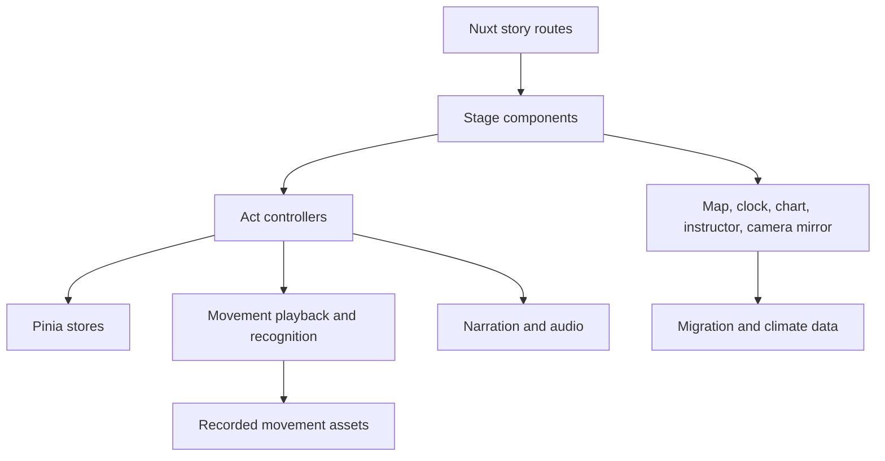

# Migration in Motion

Migration in Motion is a browser-based research prototype developed for the
Master's thesis "Data Dance: Data Storytelling with Embodiment and Emotions" at
Technische Universität Dresden. It investigates how data-driven storytelling and
data embodiment can be combined through self-performed movement representations
inside a guided multimodal data story.

## Thesis Context

This project was created at Technische Universität Dresden, Faculty of Computer
Science, Chair of Multimedia Technology.

The prototype serves as a research artifact for investigating how
self-performed movement representations can be integrated into a guided
multimodal data story. It does not claim measured improvements in comprehension,
immersion, or emotional engagement by itself; those effects remain questions for
study design, observation, and evaluation.

## Research Prototype

Migration in Motion follows selected white stork migration cycles and seasonal
temperature data for Germany. Participants see a migration map, a Seasonal
Clock, movement instruction, their own tracked skeleton, narration, rhythm, and
seasonal music.

The prototype is designed as a research artifact rather than a production
system. It includes the final participant-facing story as well as development
routes for recording movements, testing camera tracking, and diagnosing story
runtime behavior.

## Story Structure

The final participant experience uses a five-act structure:

| Act                                  | Route             | Description                                                                                                                                              |
| ------------------------------------ | ----------------- | -------------------------------------------------------------------------------------------------------------------------------------------------------- |
| Act I - Prologue                     | `/story/prologue` | Introduces white stork migration and the scientific/data context.                                                                                        |
| Act II - Guided Migration            | `/story/act-2`    | Introduces one complete reference migration cycle and teaches the recurring movement vocabulary.                                                         |
| Act III - Migration Change over Time | `/story/act-3`    | Reuses familiar movement representations across selected migration cycles and communicates differences in timing, duration, and route/wintering context. |
| Act IV - Seasonal Temperature Change | `/story/act-4`    | Introduces four seasonal movements and varies them quantitatively according to seasonal temperature data.                                                |
| Act V - Epilogue                     | `/story/epilogue` | Returns to narration/visualization and contextualizes ecological complexity and uncertainty.                                                             |

Historical `/story/act-5` and `/story/act5` routes are retained as compatibility
redirects to the current Act IV climate experience. They are not separate final
story acts.

## Key Features

- Webcam-based whole-body pose tracking with MediaPipe Tasks Vision.
- Skeleton-based Movement Instructor rendered from recorded landmark sequences.
- Beat-synchronized movement playback for migration and climate movements.
- Guided movement onboarding in Act II.
- Migration Story-Time with selected GPS migration cycles.
- Interactive migration map and Seasonal Clock.
- Seasonal temperature visualization for Act IV.
- Browser narration through Web Speech API.
- Web Audio rhythm and seasonal music loops.
- Pause/Resume support during active movement acts.
- Manual Skip fallback for blocking movement interactions where supported.
- Presenter controls via Page Up and Page Down.
- Development/debug tooling for movement recording, camera testing, and runtime
  diagnostics.

## Technology Stack

| Technology             | Purpose                                      |
| ---------------------- | -------------------------------------------- |
| Nuxt 4 / Vue 3         | Application framework and routing            |
| TypeScript             | Application and domain logic                 |
| Pinia                  | Serializable runtime state                   |
| MediaPipe Tasks Vision | Pose and hand tracking                       |
| Leaflet                | Migration map visualization                  |
| D3 / SVG               | Climate chart rendering                      |
| Web Audio API          | Rhythm, transport timing, and seasonal music |
| Web Speech API         | Browser-native narration                     |
| Sass / SCSS            | Global and component styling                 |
| Vitest                 | Unit and integration-style tests             |
| ESLint / Prettier      | Code quality and formatting                  |

## Requirements

- Node.js and npm.
- A modern browser with webcam, Web Audio, and Web Speech support.
- A webcam with enough visible space for full-body movement tracking.
- Audio output for rhythm, music, and narration.
- Internet access when MediaPipe model and WASM resources are not already
  cached. The current pose setup loads MediaPipe resources from jsDelivr and
  Google-hosted model assets.

A recent Chromium-based browser is recommended for running the full prototype,
especially for camera, audio, and speech behavior.

## Setup and Running

Install dependencies:

```bash
npm install
```

Start the development server:

```bash
npm run dev
```

Nuxt normally serves the app at `http://localhost:3000` in development.

Available project commands:

| Command                             | Purpose                                                             |
| ----------------------------------- | ------------------------------------------------------------------- |
| `npm run dev`                       | Start the local Nuxt development server.                            |
| `npm run dev:host`                  | Start Nuxt on the local network with host binding and HTTPS.        |
| `npm run build`                     | Build the production application.                                   |
| `npm run preview`                   | Preview the production build locally.                               |
| `npm run generate`                  | Generate a static Nuxt output.                                      |
| `npm run test`                      | Run the Vitest test suite.                                          |
| `npm run typecheck`                 | Run Nuxt/Vue TypeScript checks.                                     |
| `npm run lint:check`                | Run ESLint without applying fixes.                                  |
| `npm run lint`                      | Run ESLint with fixes.                                              |
| `npm run prettier`                  | Format files with Prettier.                                         |
| `npm run data:preprocess:migration` | Regenerate the curated migration story CSV from the raw stork data. |

## Interaction and Presenter Controls

The prototype can be controlled with visible buttons and with presenter keys.

Entry screens:

| Key       | Action   |
| --------- | -------- |
| Page Up   | Back     |
| Page Down | Continue |

Active movement acts:

| Key       | Action                                                                            |
| --------- | --------------------------------------------------------------------------------- |
| Page Up   | Pause                                                                             |
| Page Down | Skip Movement, only when the currently blocking movement supports manual fallback |

Pause screen:

| Key       | Action        |
| --------- | ------------- |
| Page Up   | Back to Start |
| Page Down | Resume        |

Page Down is not a general fast-forward command. It only skips the currently
blocking movement when manual fallback is available. Mouse-visible Pause,
Resume, and Skip controls are also available where appropriate.

## Architecture Overview

The project keeps the final story, runtime controllers, state, rendering,
narration, audio, movement recognition, and data utilities separated by
responsibility.

Migration and climate use separate runtime controllers because their interaction
models differ. Migration is timeline/event driven and reuses selected migration
cycles, while Act IV is a target sequence built from seasonal movement and
temperature data. Shared systems support pose tracking, movement rendering,
narration, audio transport, presenter controls, and story navigation.

Pinia stores contain serializable runtime state. Composables own browser/runtime
behavior such as camera access, playback clocks, controller lifecycles,
narration, and audio. Utility modules contain data parsing, timing, selection,
recognition, and formatting logic.



## Repository Structure

```text
src/
├── assets/        Data, audio, images, styles, pose definitions, and movements
├── components/    Vue UI, story, map, movement, narration, and record components
├── composables/   Runtime controllers, browser integrations, and shared behavior
├── locales/       User-facing English text
├── pages/         Nuxt routes
├── store/         Pinia state stores
├── story/         Narrative configuration, act definitions, and timing config
├── types/         Shared TypeScript contracts
└── utils/         Data, timing, recognition, scoring, and formatting logic
```

## Data Sources

Migration data are based on GPS tracking datasets from the Movebank Data
Repository. The final story uses selected white stork migration cycles from
LifeTrack White Stork datasets for South-West Germany and Bavaria. The raw
tracking data were processed, reduced, analysed, and curated for the prototype.

The migration acts use the versioned
`src/assets/storkdata/migration_story_cycles.csv`. Regenerate it only after an
intentional change to the curated cycle or event configuration:

```bash
npm run data:preprocess:migration
```

The preprocessing command reads `daily_stork_data.csv`, extracts exactly the
curated story cycles, validates departure and arrival events, and prints the
recognized dates.

Climate data are seasonal mean air temperature data for Germany obtained
through the UBA Data Cube. The underlying data originate from the German Weather
Service (Deutscher Wetterdienst, DWD). The active climate CSV contains six
five-year periods from 1995-1999 through 2020-2024.

The selected migration cycles are individual examples and are not intended as a
population-wide trend. The prototype does not claim that seasonal temperature
change alone caused the observed migration differences.

## Movement and Recognition

Recorded movements are rendered through the Movement Instructor so participants
can follow a visible skeleton reference. Participants are tracked with
MediaPipe-based pose detection through the webcam.

Recognition focuses on movement characteristics relevant to the intended data
representation, such as pose, timing, repetition, body expansion, or direction.
It is deliberately tolerant and prototype-tuned rather than a dance-quality
scoring system.

Some onboarding and climate interactions are blocking and require successful
completion or manual fallback. Later continuous migration recognition can be
feedback-oriented instead of stopping the story at every movement.

## Development Tools

The repository contains additional routes used during prototype development:

- `/record` - recording, video-based recording, and playback of movement
  landmark sequences.
- `/movement-camera-test` - camera, avatar, silhouette, and hand-tracking
  diagnostics.
- `/story/stage` - migration runtime, gesture, cycle, seek, and diagnostic
  controls.
- `/main` - map and Seasonal Clock runtime surface for selected migration story
  cycles.
- `/credits` - participant-facing credits and data/source attribution.

These routes are useful for development and documentation, but they are separate
from the final participant-facing narrative path.

## Known Limitations

- Browser-native text-to-speech voice availability and behavior vary by browser
  and operating system.
- MediaPipe model and WASM resources are loaded from external URLs unless cached
  by the browser.
- Movement recognition uses prototype-tuned heuristic thresholds.
- Whole-body tracking requires sufficient lighting, camera placement, and
  participant space.
- The prototype is designed for research use, not production deployment.
- Automated tests do not replace live verification of webcam tracking, room
  setup, speech output, and audio timing.

## Generative AI Assistance

Generative AI tools were used during the development of this prototype to
support software implementation, debugging, refactoring, and technical
documentation.

All generated or modified code and documentation was reviewed, tested, and
integrated by the author. The final design decisions, system architecture, data
preparation, research framing, and responsibility for the submitted prototype
remain with the author.

A more detailed disclosure of generative AI use is provided in the accompanying
Master's thesis.
